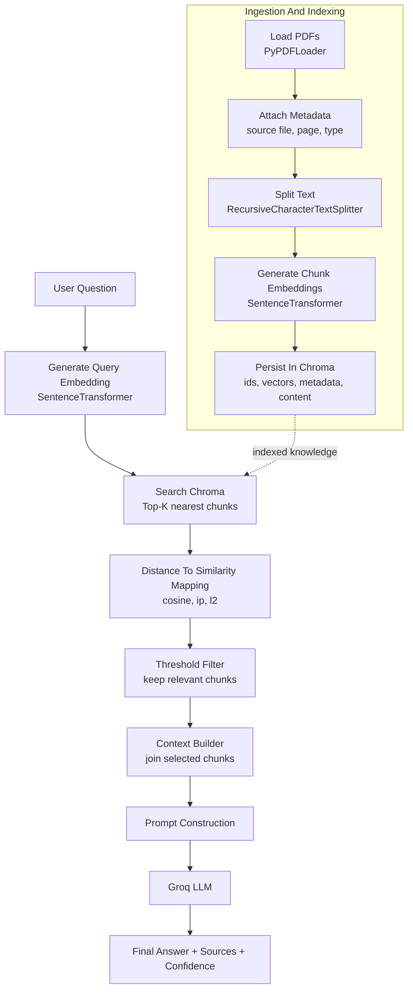
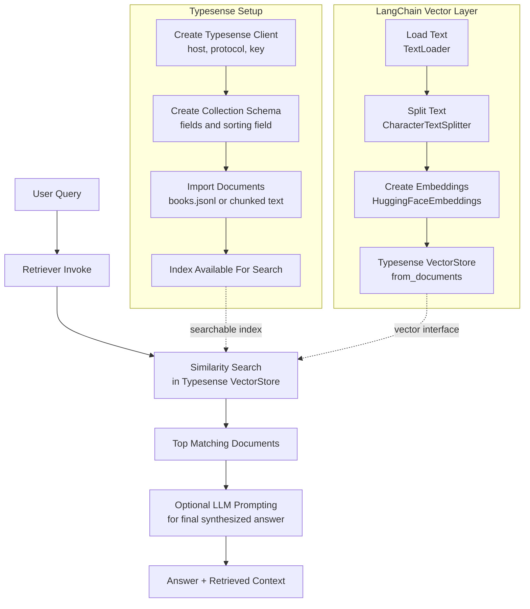

# RAG Fundamentals

RAG Fundamentals is a hands-on learning project that demonstrates how to build Retrieval-Augmented Generation (RAG) systems end to end.

The repository includes two practical retrieval pipelines:

- PDF -> chunking -> embeddings -> Chroma vector store -> retriever -> Groq LLM answer generation
- Text -> embeddings -> Typesense vector index -> retriever search flow

The project is designed for learning and interview preparation, with a focus on:

- data ingestion and metadata handling
- chunking strategy and overlap tradeoffs
- vector similarity retrieval behavior
- integrating retrieval context into LLM prompts
- debugging practical RAG issues (thresholding, distance metrics, model deprecations, import changes)

## Project Structure

```text
RAG-Fundamentals/
	data/
		excel/
		pdf/
		text_files/
	notebook/
		document.ipynb
		pdf_loader.ipynb
	typesense.ipynb
	main.py
	pyproject.toml
	requirements.txt
	.env
```

## What This Project Covers

### 1) PDF RAG Pipeline (Chroma)

Implemented in notebook/pdf_loader.ipynb:

1. Load PDFs recursively from data directories
2. Add useful metadata (source file, type, page context)
3. Split into chunks using RecursiveCharacterTextSplitter
4. Generate embeddings with SentenceTransformers
5. Store embeddings in persistent Chroma DB
6. Retrieve top-k relevant chunks for user queries
7. Build final answers with Groq LLM using retrieved context

### 2) Typesense Retrieval Pipeline

Implemented in typesense.ipynb:

1. Connect to Typesense Cloud
2. Create a collection schema
3. Import sample records
4. Run lexical/faceted searches
5. Add a LangChain Typesense vector search flow with embeddings

## Architecture And Workflows

### A) LangChain + Chroma + Groq RAG (PDF Pipeline)



Step-by-step workflow:

1. Ingest PDF documents from the data folder.
2. Add metadata per page or chunk, such as source_file and page number.
3. Split document text into overlapping chunks for retrieval granularity.
4. Create embeddings for each chunk using SentenceTransformer.
5. Store chunk text, embedding vectors, ids, and metadata in Chroma.
6. Convert incoming user query into a query embedding.
7. Perform top-k nearest-neighbor retrieval in Chroma.
8. Convert distance values into similarity scores using the correct vector space logic.
9. Apply similarity threshold to keep only useful chunks.
10. Build final context from selected chunks.
11. Send prompt and context to Groq model.
12. Return answer, sources, and confidence score.

### B) Typesense + LangChain RAG Workflow



Step-by-step workflow:

1. Initialize Typesense client with cloud host, port, protocol, and API key.
2. Define a collection schema with searchable and facetable fields.
3. Import records or chunked documents into Typesense.
4. For semantic retrieval, load local text documents in LangChain.
5. Split text into chunks.
6. Generate chunk embeddings using HuggingFaceEmbeddings.
7. Push chunks and vectors into Typesense-backed LangChain vector store.
8. Convert user query into embedding and run similarity search.
9. Return top matching chunks.
10. Optionally pass retrieved context to Groq LLM for final answer generation.

## Technology Stack

- Python 3.13+
- LangChain, LangChain Core, LangChain Community
- Sentence Transformers
- ChromaDB
- Typesense Python client
- Groq via langchain-groq
- python-dotenv

## Setup

### Option A: uv (recommended)

```bash
uv sync
```

If you also want to sync from requirements.txt:

```bash
uv add -r requirements.txt
```

### Option B: pip

```bash
python -m venv .venv
.venv\Scripts\activate
pip install -r requirements.txt
```

## Environment Variables

Create a local .env file (already gitignored) and configure values like:

```env
GROQ_API_KEY=YOUR_GROQ_API_KEY
GROQ_MODEL=llama-3.1-8b-instant
EMBEDDING_MODEL=all-MiniLM-L6-v2
CHROMA_COLLECTION_NAME=pdf_documents
CHROMA_PERSIST_DIRECTORY=./data/vector_store
PDF_DATA_DIRECTORY=./data/pdf
```

## How to Run

### Notebook flow: Chroma RAG

1. Open notebook/pdf_loader.ipynb
2. Run cells in order:
	 - ingestion
	 - splitting
	 - embedding generation
	 - vector store population
	 - retriever queries
	 - LLM answer generation

### Notebook flow: Typesense

1. Open typesense.ipynb
2. Run connection and schema cells
3. Run document import
4. Test search and retriever cells

## Example Query Prompts

Use semantically rich queries to test retrieval quality:

- What are the key concepts in this Epicor revision guide?
- Explain SQL deadlock and practical ways to prevent it.
- Summarize interview preparation topics covered in the documents.

## Common Issues and Fixes

### 1) No relevant context found

Possible causes:

- score threshold is too high
- distance metric interpretation is wrong (cosine vs l2)
- query too short or too generic

Fix:

- lower threshold (for example, 0.05)
- verify vector-space mapping for similarity
- use longer, topic-rich questions

### 2) ImportError for HuggingFaceEmbeddings

Use modern import path:

```python
from langchain_huggingface import HuggingFaceEmbeddings
```

And ensure dependency exists:

```text
langchain-huggingface
```

### 3) Groq model decommissioned

If a model is deprecated, switch to a current supported model in .env (for example llama-3.1-8b-instant).

### 4) uv install fails with numpy.libs access denied on Windows

This usually happens when a notebook kernel still holds file locks.

Fix steps:

1. Stop all active notebook kernels
2. Close terminals using the same virtual environment
3. Re-run uv add -r requirements.txt

## Security Notes

- Never commit real API keys
- Keep .env local only
- Rotate keys immediately if exposed in notebook outputs or terminal logs

## Learning Goals

This repository helps you practice and explain in interviews:

- retrieval quality tuning
- chunking strategy decisions
- vector DB design choices
- RAG pipeline debugging in production-like situations
- safe secret handling in ML/LLM workflows

## Next Improvements

- add evaluation metrics (precision@k, recall@k, hit rate)
- add hybrid retrieval (keyword + vector)
- add reranker stage
- add source citation formatting for final answers
- package core logic into reusable Python modules